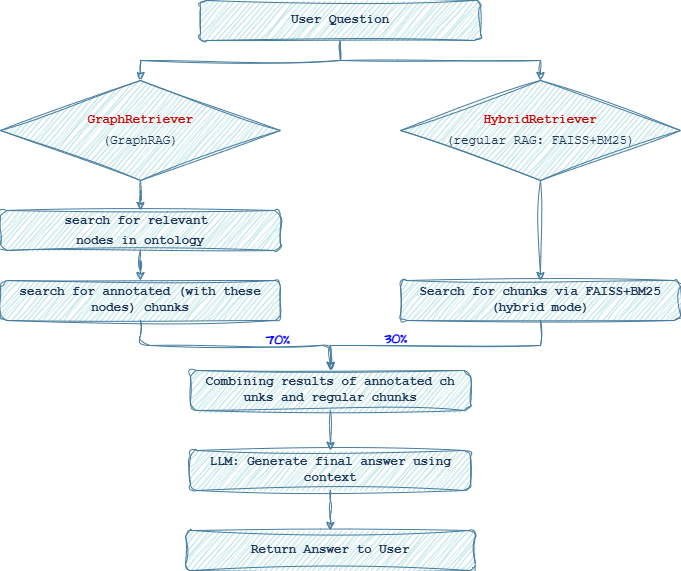

# ModifiedGraphRAG Implementation

A modified GraphRAG system that uses a knowledge graph (ontology) as navigation to more relevant document chunks. Combines two sources for context generation: chunks annotated by the knowledge graph (GraphRAG) and those obtained by the standard RAG approach.  

**Report**: [Report.pdf](Report.pdf)

## System architecture

The system consists of the following components:

1. **HybridRetriever** - regular hybrid chunk search (FAISS+BM25) without graph
2. **GraphRetriever** - search for relevant nodes in the knowledge graph
3. **OntologyAnnotator** - annotating chunks using ontology
4. **AnnotatedChunkRetriever** - chunk search by graph nodes
5. **GraphRAGRetriever** - combining graph and hybrid (FAISS+BM25) searches
   
+ component for *creating chunks from source pdf-files*
+ component for *parsing of ontology and creating knowledge graph*

## Work process

1. **Receive user query**
2. **Search for relevant nodes** in the ontology via GraphRetriever
3. **Search for annotated chunks** on the found nodes
4. **Search for chunks via FAISS/BM25 (hybrid mode)** 
5. **Combining results of annotated chunks and regular chunks** (para. 3 + 4) with default weights (graph: 0.7, traditional: 0.3)
6. **Transfer to generator** (LLM) for a response



## Installation and setup

### 1. File structure

```
project/
├── data/
│   ├── indexes/                             # Indices FAISS/BM25
│   ├── ontology/                            # RDF/OWL ontology files
│   ├── chunks.json                          # Source document chunks
│   ├── annotated_chunks.json                # Annotated chunks
│   └── fibo_knowledge_graph.gpickle         # Knowledge graph
├── graph_rag/
│    ├── config/
│    │   └── config.py                       # Configuration
│    ├── core/
│    │   ├── retrievers/
│    │   │   ├── bm25_retriever.py           # bm25_retriever (for regular searching)
│    │   │   ├── faiss_retriever.py          # faiss_retriever (for regular searching)
│    │   │   ├── hybrid_retriever.py         # FAISS/BM25 (hybrid mode) (for regular searching)
│    │   │   ├── graph_rag_retriever.py      # Main classes GraphRAG
│    │   ├── chunking.py                     # Creating chunks 
│    │   ├── pdf_parser.py                   # Parsing of pdf-files
│    ├── scripts/
│    │   ├── run_retriever.py                # Common retriever (for both approaches) 
│    │   ├── build_chunks.py                 # Chunk creation knowledge graph from ontology script
│    │   ├── parse_fibo_to_kg.py             # Creation of script
│    │   ├── graph_rag_integration.py        # Integration module
│    │   └── annotation_utils.py             # Annotation utilities
```

### 2. Creating a knowledge graph

```bash
python -m graph_rag.scripts.parse_fibo_to_kg
```

### 3. Retrieving system

```bash
# Creating indexes for regular search
python -m graph_rag.scripts.run_retriever --build

# Creating annotated chunks using ontology
python -m graph_rag.scripts.annotation_utils \
    --chunks data/chunks.json \
    --graph data/fibo_knowledge_graph.gpickle \
    --output data/annotated_chunks.json \
    --min-confidence 0.7
```

## Usage

### Search

```bash
# Using GraphRAG + regular RAG_FAISS+BM25
python -m graph_rag.scripts.run_retriever --query "banking compliance" --method graph_rag -k 10

# Using only regular RAG_FAISS+BM25
python -m graph_rag.scripts.run_retriever --query "risk management" --method regular -k 10
```

### Comparison of methods

```bash
# Comparison of available methods
python -m graph_rag.scripts.run_retriever --query "capital requirements" --compare -k 5
```

### Evaluate

```bash
# test dataset is loaded inside the run with Hugging Face "yymYYYM/stock_trading_QA", these questions were not present in any format when preparing RAG / GraphRAG (it is new data)
# for generation here used very small model (TinyLlama/TinyLlama-1.1B-Chat-v1.0) due to the lack of space on the local machine for loading large models
python -m graph_rag.evaluation.evaluate_graphrag
```

### One_answer
```bash
python -m graph_rag.scripts.generate_answer_cli "What is EBITDA?" graph_rag 10
```

## Data

### The Financial Industry Business Ontology (FIBO): 

An international formal ontology originally created by the EDM Council (a not-for-profit, cross-industry data and analytics management association) to provide a common framework for financial contracts worldwide. It emerged as a result of the need to standardise terminology for regulatory reporting and other analytics globally, which was identified during the 2008 financial crisis. It was first published in 2014 and has grown and improved continuously since then. Changes are made on an ongoing basis by several domain-specific teams (e.g. securities, derivatives and indices) and are available on FIBO [GitHub](https://github.com/edmcouncil/fibo) and special [web-page](https://spec.edmcouncil.org/fibo/), with formal updates published quarterly.\\
	
FIBO is developed as an ontology in the Web Ontology Language (OWL). OWL is currently the World Wide Web Consortium's (W3C) recommended language for ontologies. The basic elements of the language are properties, classes, and constraints. Using logic ensures that each FIBO concept is formulated in a single-valued way, making it readable by both humans and machines. Since January 2020, the community has been developing FIBO in an open process to provide a machine-readable, unambiguous standard for financial terminology.\\
	
The ontology includes 10 thematic ontologies on the main sections of finance, contains 1159 classes (entities), 764 relations, about 15,000 axioms and 52 annotations.\\

### Domain-specific texts
	
For this part was used materials for preparation for financial exams - this source was chosen because it is the most structured, standardised and covers in a single structure the key areas of financial science, also it's recognised by the professional community.